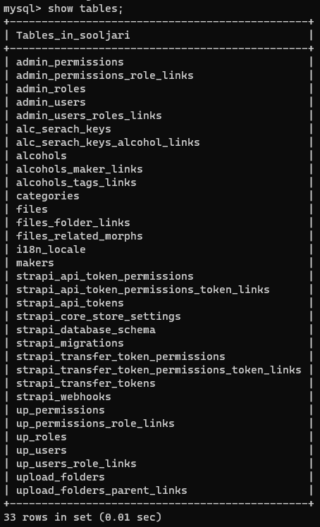

# mysql 초기설정

docker를 통해 설치했으며, 이미지 버전은 latest로 설정함  
볼륨은 `./.db:/var/lib/mysql`으로 설정함, .db 폴더는 직접 만들어야 합니다

root 비밀번호 등은 모두 .env 파일을 통해 설정됩니다. .env.example 참고

## 초기 설정

아래의 ${} 내부는 모두 .env의 설정에서 가져오면 됩니다

### 유저 추가

```sql
USE mysql;
CREATE USER '${DATABASE_USERNAME}'@'localhost' IDENTIFIED BY '${DATABASE_PASSWORD}';
GRANT ALL PRIVILEGES ON ${DATABASE_NAME}.* TO '${DATABASE_USERNAME}'@'localhost';
```

- 만약 localhost 외에 외부에서 접근 가능하게 하고싶은 경우
  CREATE 구문에서 `'localhost'` -> `'%'`
- 만약 모든 데이터베이스에 대해 권한을 주고싶은 경우
  GRANT 구문에서 `${DATABASE_NAME}.*` -> `*.*`

### 데이터베이스 확인 / 테이블 확인

```sql
SHOW databases;

USE ${DATABASE_NAME}
Show tables;
# 혹은
Show tables FROM ${DATABASE_NAME};
```

### strapi에서의 사용



기본적인 테이블들은 유지되며, relation들은 links라는 접미를 붙인 테이블로 구성한다.  
복수형 테이블명을 사용하니 참고
