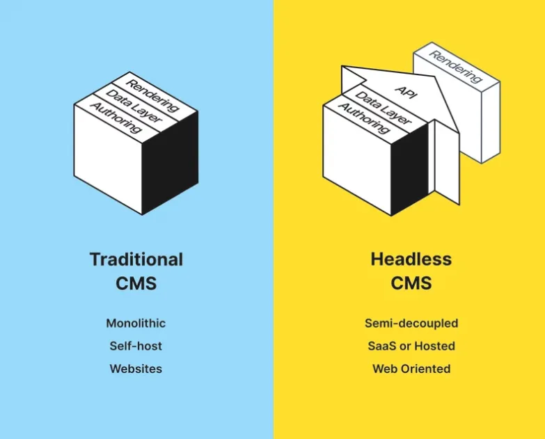

# strapi에 대하여

## Headless CMS


기존의 CMS가 DB-서버-사이트(프론트)를 모두 제공한다면 (카페24의 쇼핑몰같은)

Headless CMS는 "DB-서버"까지만 제공하고 해당하는 api를 넘겨준다.  
이때 프론트는 원하는 프레임워크, 원하는 환경을 사용 가능하다는 장점이 있다.  
웹, 모바일도 무관하고, React를 쓸지 Vue를 쓸지도 자유롭게 선택 가능하다.

## Quick Start

https://docs.strapi.io/dev-docs/quick-start#_1-install-strapi-and-create-a-new-project

퀵스타트시 sqlite로 생성되는 점을 유의

이후 어드민 패널에서 최초 관리자를 생성하고 그 계정으로 접근한다

1337포트를 기본적으로 사용하며, 아래의 라우팅이 기본적으로 제공된다

- / : 기본 제공 웹사이트
- /admin : 어드민 패널
- /api : api 호출을 위한 경로

## Documentation

플러그인을 통해 DB와 api를 자동으로 문서화해주는 Swagger를 사용 가능하다.

https://docs.strapi.io/dev-docs/plugins/documentation

이후 실행부터는 /documentation 을 통해 api 문서에 접근 가능하다

## ERD 플러그인

https://market.strapi.io/plugins/strapi-plugin-entity-relationship-chart

https://market.strapi.io/plugins/strapi-content-type-explorer

아래쪽게 더 깔끔하게 낫다

플러그인 설치때마다 `npx strapi build`를 실행해줘야 어드민 페이지에 적용된다.

## strapi API 사용법

그냥 되는경우는 거의 없고, 로그인을 통해 jwt를 발급받아야 사용 가능하다

1. 회원가입 or 로그인

회원가입 혹은 로그인을 통해 jwt를 발급받는다.

이 경우, 로그인을 설명하겠습니다.

```js
// JS 코드 예시
const loginRes = await fetch(`${ip}api/auth/local`, {
  method: "POST",
  headers: {
    "Content-Type": "application/json",
  },
  body: JSON.stringify({
    identifier: id,
    password: pw,
  }),
});
const loginData = await loginRes.json();
if (!loginRes.ok) {
  console.error(loginString);
  process.exit(loginRes.status);
} else {
  jwt = loginData.jwt;
}
```

요약하면,

POST /api/auth/local

body에는 identifier와 password를 넣어서 보내야 한다

돌아오는 값은 다음과 같은 형태를 띤다

```json
{
  "jwt": "testjwttestjwt.testjwttestjwt.testjwttestjwt",
  "user": {
    "id": 1,
    "username": "foo.bar",
    "email": "foo.bar@strapi.io",
    "provider": "local",
    "confirmed": true,
    "blocked": false,
    "createdAt": "2022-06-02T08:32:06.258Z",
    "updatedAt": "2022-06-02T08:32:06.267Z"
  }
}
```

테스트용 ID, PW는 문의해주시기 바랍니다

2. jwt 헤더에 적용

1번에서 온 jwt를 헤더에 넣어야 한다.

```js
// JS 코드 예시
const res = await fetch(`${ip}api/makers`, {
  method: "POST",
  headers: {
    "Content-Type": "application/json",
    // 이부분이 매우 중요
    Authorization: `Bearer ${jwt}`,
  },
  body: JSON.stringify({
    data: {
      name: ele.양조장,
      nation: ele.생산지1,
      location: ele.생산지2,
    },
  }),
});
```

이것도 요약하면, header에 Authorization의 데이터로 아까의 jwt 앞에 'Bearer '를 붙여서 넣어야 한다.

이후의 요청은 유저 로그인이 적용된 상태로 요청이 들어가게 된다

3. 원하는 요청 보내기!

다양한 요청은 서버/documentation/ 페이지에서 볼 수 있다.

Swagger UI에 익숙하지 않다면 화이팅

## api customization

[alcohol.js](/src/api/alcohol/controllers/alcohol.js)

기본으로 사용되는 findOne의 형태를 바꾸었다.

https://docs.strapi.io/dev-docs/backend-customization/controllers
